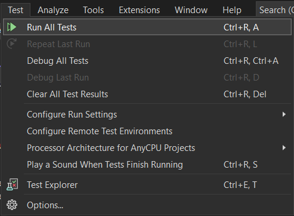
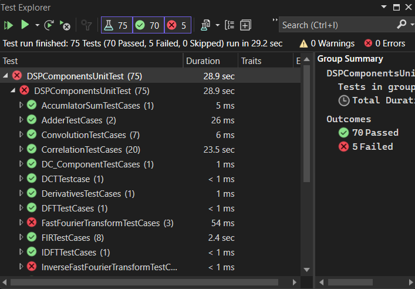

# DSP Package
---
## Introduction
>DSP Package featuring many common Digtal Signal Processing algorithms with Testing Unit and GUI to plot the resulted signals.

---
---
## Algorithms

 1. ### Simple Signal Processing Tasks
* [**Adder**](https://github.com/MuhammadS25/DigtalSignalProcessing/blob/main/DSPComponents/Algorithms/Adder.cs)

>Featuring the ability to add two signals.

* [**MultiplySignalByConstant**](https://github.com/MuhammadS25/DigtalSignalProcessing/blob/main/DSPComponents/Algorithms/MultiplySignalByConstant.cs)

>Featuring the ability to amplify or reduce the signal amplitude through multipling by a constant.

* [**Subtractor**](https://github.com/MuhammadS25/DigtalSignalProcessing/blob/main/DSPComponents/Algorithms/Subtractor.cs)

>Featuring the ability to subtract two signals.

* [**Normalizer**](https://github.com/MuhammadS25/DigtalSignalProcessing/blob/main/DSPComponents/Algorithms/Normalizer.cs)

>Featuring the ability to normalize a signal depends on chosen range.

* [**SinCos**](https://github.com/MuhammadS25/DigtalSignalProcessing/blob/main/DSPComponents/Algorithms/SinCos.cs)

>Featuring the ability to generate sinusoidal or cosinusoidal signals.

* [**Moving Average**](https://github.com/MuhammadS25/DigtalSignalProcessing/blob/main/DSPComponents/Algorithms/MovingAverage.cs)

>Featuring the ability to move the mean of the signal.

* [**DC Component**](https://github.com/MuhammadS25/DigtalSignalProcessing/blob/main/DSPComponents/Algorithms/DC_Component.cs)

>Featuring the ability to centralize the signal through removing dc component.

* [**Accumulation Sum**](https://github.com/MuhammadS25/DigtalSignalProcessing/blob/main/DSPComponents/Algorithms/AccumulationSum.cs)

>Featuring the ability to Accumulate the signal.

* [**Accumulation Sum**](https://github.com/MuhammadS25/DigtalSignalProcessing/blob/main/DSPComponents/Algorithms/Derivatives.cs)

>Sharpening the signal through first and second derivative.

* [**Folder**](https://github.com/MuhammadS25/DigtalSignalProcessing/blob/main/DSPComponents/Algorithms/Folder.cs)

>Featuring the ability to fold a signal.

* [**Shifter**](https://github.com/MuhammadS25/DigtalSignalProcessing/blob/main/DSPComponents/Algorithms/Shifter.cs)

>Featuring the ability to shift a signal.

* [**DCT**](https://github.com/MuhammadS25/DigtalSignalProcessing/blob/main/DSPComponents/Algorithms/DCT.cs)

>Computing DCT for a signal.
---
---

 2. ### [**Discrete Fourier transform**](https://github.com/MuhammadS25/DigtalSignalProcessing/blob/main/DSPComponents/Algorithms/DiscreteFourierTransform.cs)

>Featuring the ability to translate the signal from time domain to frequency domain through applying Fourier transform.

 3. ### [**Inverse Discrete Fourier Transform**](https://github.com/MuhammadS25/DigtalSignalProcessing/blob/main/DSPComponents/Algorithms/InverseDiscreteFourierTransform.cs)

>Featuring the ability to translate the signal from frequency domain to time domain through applying inverse Fourier transform.

* **Note**: due to the similarity between DFT and IDFT Computed harmonics are the same steps which exists as a function in DFT file.

 4. ### [**Quantization**](https://github.com/MuhammadS25/DigtalSignalProcessing/blob/main/DSPComponents/Algorithms/QuantizationAndEncoding.cs)

>Featuring The ability to quantize the samples of a signal.

 5. ### [**Time Delay**](https://github.com/MuhammadS25/DigtalSignalProcessing/blob/main/DSPComponents/Algorithms/TimeDelay.cs)

>Featuring The ability to Delay or advance a signal.

 6. ### Convolution

* [**Fast Convolution**](https://github.com/MuhammadS25/DigtalSignalProcessing/blob/main/DSPComponents/Algorithms/FastConvolution.cs) and [**Direct Convolution**](https://github.com/MuhammadS25/DigtalSignalProcessing/blob/main/DSPComponents/Algorithms/DirectConvolution.cs).

>Featuring The ability to convolve two signals.

 7. ### Correlation

* [**Fast Correlation**](https://github.com/MuhammadS25/DigtalSignalProcessing/blob/main/DSPComponents/Algorithms/FastCorrelation.cs) and [**Direct Correlation**](https://github.com/MuhammadS25/DigtalSignalProcessing/blob/main/DSPComponents/Algorithms/DirectCorrelation.cs).

>Featuring The ability to perform auto and cross Correlation.

 8. ### [**Filtering**](https://github.com/MuhammadS25/DigtalSignalProcessing/blob/main/DSPComponents/Algorithms/FIR.cs)

>Featuring The ability to apply linear phase filter (FIR) for a given signal.

 9. ### [**Multi rate Signal Processing**](https://github.com/MuhammadS25/DigtalSignalProcessing/blob/main/DSPComponents/Algorithms/Sampling.cs)

>Featuring The ability to apply upSampling and downSampling for a given signal.

 10. ### [**Saving**](https://github.com/MuhammadS25/DigtalSignalProcessing/blob/main/DSPComponents/Algorithms/PracticalTask2.cs)

>Featuring The ability to save a signal to have the ability to plot it.

---
---
### [**Testing Unit**](https://github.com/MuhammadS25/DigtalSignalProcessing/tree/main/DSPComponentsUnitTest)

* Displaying The Result of testing the algorithmis

---
---
## GUI

* After running the project it will display gui window to load or apply any algorithm.

* Through **Load** we can load or plot saved signals.

* After loading a signal we can apply it to the desired algorithm and plot the result.

* After specifing every algorithm arguments, clicking **run** to display the resulted signal.

